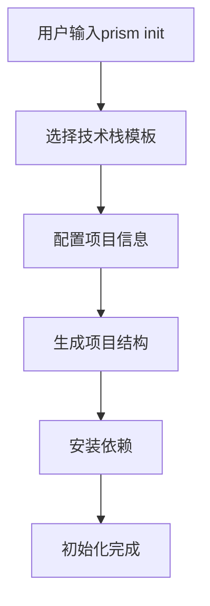
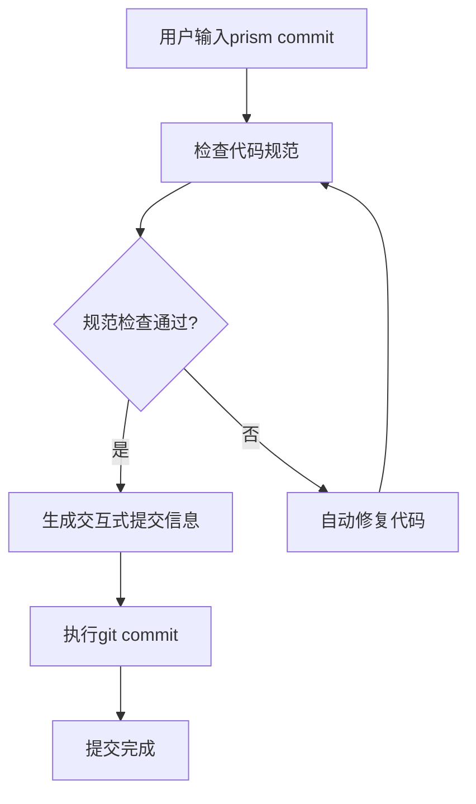
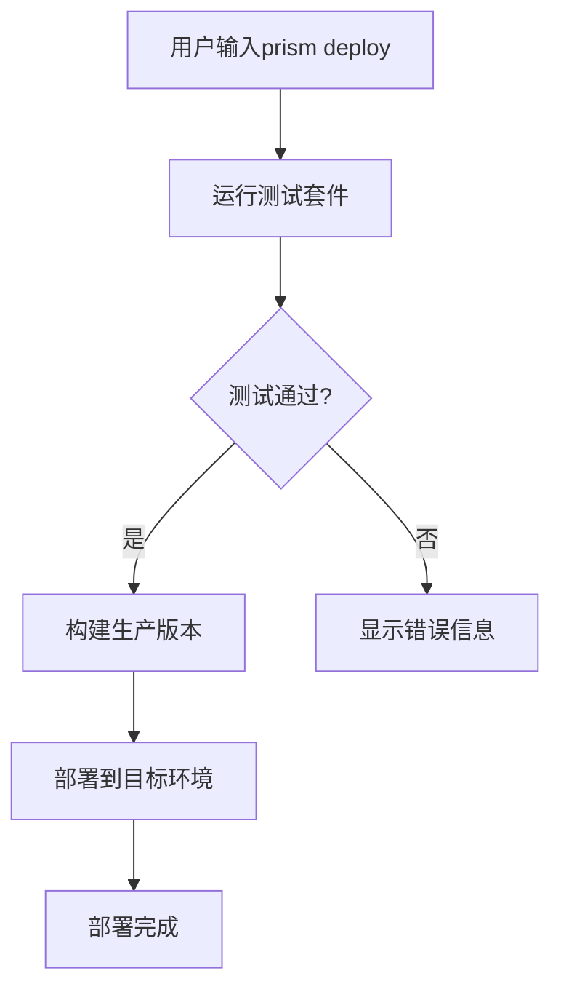

## 1. 产品概述
棱镜团队CLI是一个专为开发团队设计的命令行工具，旨在标准化开发流程、提升代码质量和团队协作效率。通过集成项目脚手架、代码规范检查、Git工作流辅助等功能，为团队提供统一的开发体验。

## 2. 核心功能

### 2.1 用户角色
| 角色 | 使用方式 | 核心权限 |
|------|----------|----------|
| 开发人员 | 命令行安装使用 | 使用所有CLI功能 |
| 团队负责人 | 命令行安装使用 | 配置团队规范、管理项目模板 |

### 2.2 功能模块
棱镜团队CLI包含以下核心功能模块：
1. **项目脚手架生成器**：快速创建标准化项目结构
2. **代码规范检查器**：自动检查和格式化代码
3. **Git工作流助手**：规范化提交信息和分支管理
4. **团队配置管理**：统一的开发环境配置
5. **开发工具集成**：构建、测试、部署工具链
6. **文档生成器**：自动生成项目文档
7. **依赖管理器**：依赖检查和安全扫描

### 2.3 功能详情
| 功能名称 | 模块名称 | 功能描述 |
|----------|----------|----------|
| 项目初始化 | 脚手架生成器 | 基于技术栈模板快速创建项目结构，支持React、Vue、Node.js等主流框架 |
| 代码检查 | 规范检查器 | 集成ESLint、Prettier等工具，支持自定义规则配置 |
| Git提交 | 工作流助手 | 交互式提交信息生成，遵循Conventional Commits规范 |
| 分支管理 | 工作流助手 | 自动化分支创建、合并和清理流程 |
| 环境配置 | 配置管理 | 管理编辑器配置、环境变量和依赖版本 |
| 构建部署 | 工具集成 | 一键构建、测试和部署到不同环境 |
| 文档生成 | 文档工具 | 从代码注释生成API文档和项目说明 |
| 依赖扫描 | 安全管理 | 检测依赖漏洞，提供升级建议 |

## 3. 核心流程

### 3.1 项目初始化流程


### 3.2 代码提交流程


### 3.3 部署流程


## 4. 用户界面设计

### 4.1 设计原则
- **简洁性**：命令结构清晰，参数直观
- **交互性**：提供友好的交互式界面
- **一致性**：统一的命令格式和输出风格
- **可定制性**：支持个性化配置

### 4.2 命令设计
| 命令 | 描述 | 示例 |
|------|------|------|
| prism init | 初始化新项目 | prism init --template react |
| prism check | 代码规范检查 | prism check --fix |
| prism commit | 交互式提交 | prism commit |
| prism deploy | 部署项目 | prism deploy --env production |
| prism docs | 生成文档 | prism docs --output ./docs |

### 4.3 输出格式
- 使用彩色输出区分不同级别的信息
- 进度条显示长时间运行的任务
- 清晰的错误提示和解决建议
- 支持JSON格式输出便于脚本集成

## 5. 技术实现

### 5.1 技术栈选择
- **运行时**：Node.js 18+（良好的CLI生态）
- **命令行框架**：Commander.js（成熟的命令解析）
- **交互界面**：Inquirer.js（友好的交互提示）
- **文件操作**：fs-extra（增强的文件系统操作）
- **网络请求**：axios（API调用）
- **配置管理**：conf（用户配置持久化）

### 5.2 架构设计
```
prism-cli/
├── bin/                    # 可执行文件
├── src/
│   ├── commands/           # 命令实现
│   ├── core/              # 核心功能
│   ├── templates/         # 项目模板
│   ├── utils/             # 工具函数
│   └── config/            # 配置管理
├── tests/                  # 测试文件
└── docs/                   # 文档
```

### 5.3 扩展性设计
- 插件系统支持自定义命令
- 模板系统支持团队特定需求
- 配置文件支持层级覆盖
- 钩子机制支持流程扩展