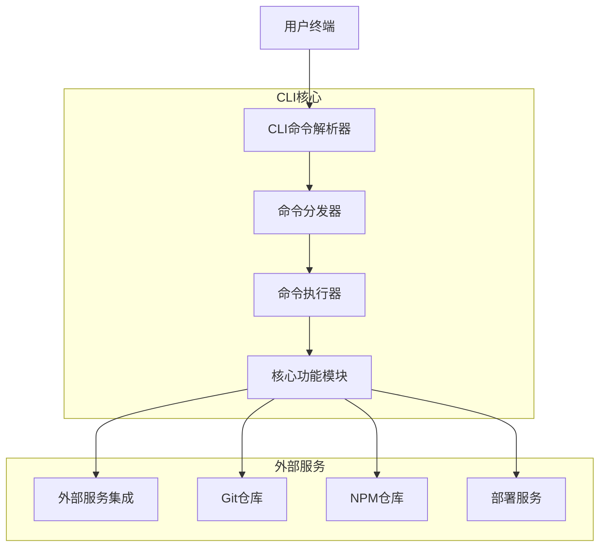
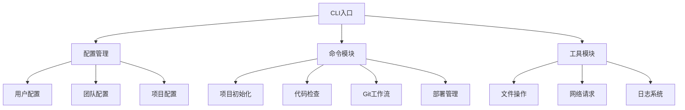

## 1. 架构设计

### 1.1 整体架构



### 1.2 模块架构



## 2. 技术描述

### 2.1 核心技术栈

* **运行时环境**：Node.js 18+ (LTS版本)

* **包管理器**：npm (内置) + pnpm (推荐)

* **初始化工具**：npm init / pnpm create

* **CLI框架**：Commander.js + Inquirer.js

* **构建工具**：esbuild (快速打包)

* **测试框架**：Jest + Testing Library

* **代码质量**：ESLint + Prettier + Husky

### 2.2 依赖库选择

```json
{
  "dependencies": {
    "commander": "^11.0.0",
    "inquirer": "^9.2.0",
    "chalk": "^5.3.0",
    "ora": "^7.0.0",
    "fs-extra": "^11.1.0",
    "axios": "^1.5.0",
    "conf": "^11.0.0",
    "semver": "^7.5.0",
    "yaml": "^2.3.0"
  },
  "devDependencies": {
    "@types/node": "^20.0.0",
    "typescript": "^5.0.0",
    "jest": "^29.0.0",
    "eslint": "^8.0.0",
    "prettier": "^3.0.0"
  }
}
```

## 3. 命令定义

### 3.1 核心命令

| 命令     | 参数                  | 描述    | 示例                               |
| ------ | ------------------- | ----- | -------------------------------- |
| init   | --template, --name  | 初始化项目 | `prism init --template react`    |
| check  | --fix, --staged     | 代码检查  | `prism check --fix`              |
| commit | --type, --scope     | 交互式提交 | `prism commit`                   |
| branch | --create, --delete  | 分支管理  | `prism branch --create feature`  |
| deploy | --env, --build      | 部署项目  | `prism deploy --env staging`     |
| config | --set, --get        | 配置管理  | `prism config --set author.name` |
| docs   | --output, --format  | 生成文档  | `prism docs --output ./api-docs` |
| audit  | --fix, --production | 依赖审计  | `prism audit --fix`              |

### 3.2 命令参数规范

```typescript
interface CommandOptions {
  // 通用选项
  verbose?: boolean;      // 详细输出
  quiet?: boolean;        // 静默模式
  config?: string;        // 配置文件路径
  
  // 项目相关
  template?: string;      // 项目模板
  name?: string;         // 项目名称
  directory?: string;     // 目标目录
  
  // 代码检查
  fix?: boolean;          // 自动修复
  staged?: boolean;       // 只检查暂存文件
  format?: string;        // 输出格式
  
  // 部署相关
  env?: string;           // 部署环境
  build?: boolean;        // 是否构建
  dryRun?: boolean;       // 试运行
}
```

## 4. 核心模块设计

### 4.1 项目初始化模块

```typescript
interface ProjectTemplate {
  name: string;
  description: string;
  files: TemplateFile[];
  dependencies: Record<string, string>;
  devDependencies: Record<string, string>;
  scripts: Record<string, string>;
}

interface ProjectGenerator {
  createProject(template: string, options: ProjectOptions): Promise<void>;
  validateTemplate(template: string): boolean;
  installDependencies(directory: string): Promise<void>;
  initializeGit(directory: string): Promise<void>;
}
```

### 4.2 代码检查模块

```typescript
interface CodeChecker {
  runLinter(files: string[], options: LintOptions): Promise<LintResult>;
  runFormatter(files: string[], options: FormatOptions): Promise<FormatResult>;
  runTypeCheck(directory: string): Promise<TypeCheckResult>;
  generateReport(results: CheckResult[]): Promise<Report>;
}

interface LintOptions {
  fix: boolean;
  cache: boolean;
  configPath?: string;
  rules?: Record<string, any>;
}
```

### 4.3 Git工作流模块

```typescript
interface GitWorkflow {
  createBranch(name: string, base: string): Promise<void>;
  switchBranch(name: string): Promise<void>;
  deleteBranch(name: string, force: boolean): Promise<void>;
  listBranches(): Promise<BranchInfo[]>;
  
  stageFiles(files: string[]): Promise<void>;
  commitChanges(message: CommitMessage): Promise<void>;
  generateCommitMessage(changes: ChangeInfo[]): Promise<string>;
}

interface CommitMessage {
  type: string;
  scope?: string;
  subject: string;
  body?: string;
  footer?: string;
}
```

### 4.4 配置管理模块

```typescript
interface ConfigManager {
  get<T>(key: string): T | undefined;
  set<T>(key: string, value: T): Promise<void>;
  delete(key: string): Promise<void>;
  clear(): Promise<void>;
  
  loadProjectConfig(path: string): Promise<ProjectConfig>;
  saveProjectConfig(config: ProjectConfig): Promise<void>;
}

interface ProjectConfig {
  name: string;
  version: string;
  template: string;
  settings: Record<string, any>;
  scripts: Record<string, string>;
}
```

## 5. 文件结构

### 5.1 项目目录结构

```
prism-cli/
├── bin/
│   └── prism.js              # CLI入口文件
├── src/
│   ├── commands/             # 命令实现
│   │   ├── init.ts
│   │   ├── check.ts
│   │   ├── commit.ts
│   │   ├── deploy.ts
│   │   └── config.ts
│   ├── core/                 # 核心功能
│   │   ├── generator.ts
│   │   ├── checker.ts
│   │   ├── git.ts
│   │   └── config.ts
│   ├── templates/            # 项目模板
│   │   ├── react/
│   │   ├── vue/
│   │   ├── node/
│   │   └── python/
│   ├── utils/                # 工具函数
│   │   ├── logger.ts
│   │   ├── spinner.ts
│   │   ├── validator.ts
│   │   └── downloader.ts
│   ├── types/                # 类型定义
│   │   └── index.ts
│   └── index.ts              # 主入口
├── tests/                    # 测试文件
├── docs/                     # 文档
├── examples/                 # 示例项目
├── scripts/                  # 构建脚本
├── .github/                  # GitHub配置
├── package.json
├── tsconfig.json
├── jest.config.js
└── README.md
```

### 5.2 模板系统

```
templates/
├── react/
│   ├── package.json
│   ├── tsconfig.json
│   ├── .eslintrc.js
│   ├── .prettierrc
│   ├── src/
│   └── public/
├── vue/
│   ├── package.json
│   ├── vite.config.ts
│   ├── src/
│   └── public/
└── node/
    ├── package.json
    ├── src/
    └── tests/
```

## 6. 错误处理

### 6.1 错误类型定义

```typescript
enum ErrorCode {
  INVALID_TEMPLATE = 'INVALID_TEMPLATE',
  DEPENDENCY_ERROR = 'DEPENDENCY_ERROR',
  GIT_ERROR = 'GIT_ERROR',
  NETWORK_ERROR = 'NETWORK_ERROR',
  CONFIG_ERROR = 'CONFIG_ERROR',
  PERMISSION_ERROR = 'PERMISSION_ERROR'
}

class PrismError extends Error {
  constructor(
    public code: ErrorCode,
    message: string,
    public details?: any
  ) {
    super(message);
    this.name = 'PrismError';
  }
}
```

### 6.2 错误处理策略

* 用户友好的错误提示

* 详细的错误日志记录

* 自动错误报告机制

* 恢复建议和解决方案

## 7. 性能优化

### 7.1 优化策略

* 命令懒加载：按需加载命令模块

* 缓存机制：缓存模板、配置和检查结果

* 并行处理：并发执行独立任务

* 增量检查：只检查变更的文件

### 7.2 监控指标

* 命令执行时间

* 内存使用情况

* 网络请求性能

* 错误率和恢复率

## 8. 扩展性设计

### 8.1 插件系统

```typescript
interface Plugin {
  name: string;
  version: string;
  commands: Command[];
  hooks: PluginHooks;
}

interface PluginHooks {
  beforeCommand?: (context: CommandContext) => Promise<void>;
  afterCommand?: (context: CommandContext) => Promise<void>;
  onError?: (error: Error, context: CommandContext) => Promise<void>;
}
```

### 8.2 配置扩展

* 支持用户自定义命令

* 支持团队特定模板

* 支持第三方集成

* 支持工作流自定义

